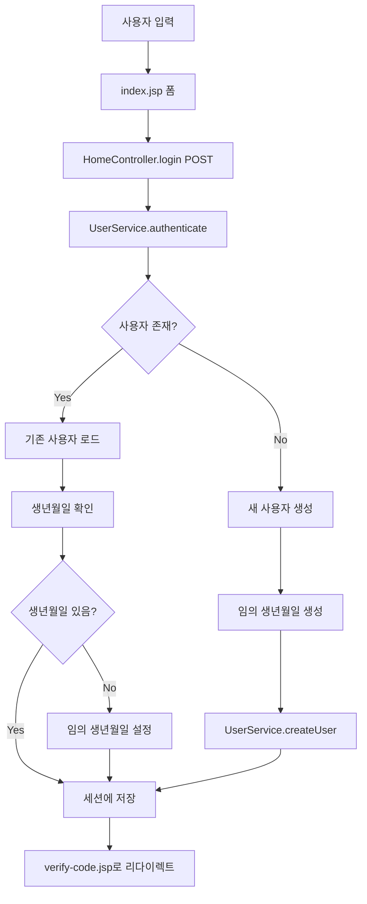

# User 처리 프로세스 문서

## 📋 개요
이 문서는 `user` 테이블에 이름, 핸드폰번호, 생년월일을 저장하는 프로세스와 관련된 모든 파일들을 설명합니다.

---

## 🗂️ 관련 파일 구조

### 1. 데이터베이스 관련 파일들

#### 📄 `src/main/resources/db/init.sql`
- **역할**: 데이터베이스 테이블 생성 스크립트
- **내용**: `user` 테이블 구조 정의
```sql
CREATE TABLE IF NOT EXISTS user (
    id BIGINT AUTO_INCREMENT PRIMARY KEY,
    name VARCHAR(100) NOT NULL,
    phone_number VARCHAR(20) NOT NULL,
    birth_date DATE,
    created_at TIMESTAMP DEFAULT CURRENT_TIMESTAMP,
    updated_at TIMESTAMP DEFAULT CURRENT_TIMESTAMP ON UPDATE CURRENT_TIMESTAMP,
    INDEX idx_phone_number (phone_number)
);
```

### 2. 엔티티 클래스

#### 📄 `src/main/java/com/jj/fraud_System/entity/User.java`
- **역할**: JPA 엔티티 클래스, 데이터베이스 테이블과 매핑
- **주요 필드**:
  - `id` (BIGINT, AUTO_INCREMENT, PRIMARY KEY)
  - `name` (VARCHAR(100), NOT NULL)
  - `phoneNumber` (VARCHAR(20), NOT NULL) 
  - `birthDate` (DATE, nullable)
  - `createdAt` (TIMESTAMP, 자동 생성)
  - `updatedAt` (TIMESTAMP, 자동 수정)
- **특징**: 
  - `@PrePersist`, `@PreUpdate`로 자동 시간 설정
  - `@OneToMany`로 GiftCard와 연관관계 설정

### 3. 데이터 접근 계층

#### 📄 `src/main/java/com/jj/fraud_System/repository/UserRepository.java`
- **역할**: Spring Data JPA Repository 인터페이스
- **주요 메서드**:
  - `findByNameAndPhoneNumber(String name, String phoneNumber)` - 로그인 인증용
  - `findByPhoneNumber(String phoneNumber)` - 핸드폰번호로 검색
  - `findByNameOrPhoneNumberContaining(String name, String phoneNumber)` - 이름/핸드폰번호 검색

### 4. 비즈니스 로직 계층

#### 📄 `src/main/java/com/jj/fraud_System/service/UserService.java`
- **역할**: 사용자 관련 비즈니스 로직 처리
- **주요 메서드**:
  - `createUser(String name, String phoneNumber, String birthDateStr)` - 새 사용자 생성
  - `updateUser(Long id, String name, String phoneNumber, String birthDateStr)` - 사용자 정보 수정
  - `authenticate(String name, String phoneNumber)` - 로그인 인증
  - `save(User user)` - 사용자 저장
  - `findById(Long id)` - ID로 사용자 조회
  - `findAll()` - 모든 사용자 조회

### 5. 컨트롤러 계층

#### 📄 `src/main/java/com/jj/fraud_System/controller/HomeController.java`
- **역할**: 사용자 로그인 요청 처리
- **주요 메서드**:
  - `@GetMapping("/")` - 메인 로그인 페이지
  - `@PostMapping("/login")` - 로그인 처리
  - `@GetMapping("/verify-code")` - 2차 인증 페이지
  - `@PostMapping("/verify-code")` - 인증코드 처리

### 6. 프론트엔드 파일들

#### 📄 `src/main/webapp/WEB-INF/views/index.jsp`
- **역할**: 사용자 로그인 폼
- **입력 필드**:
  - `name` - 이름 입력
  - `phoneNumber` - 핸드폰번호 입력 (자동 포맷팅)
- **특징**: JavaScript로 핸드폰번호 자동 포맷팅

#### 📄 `src/main/webapp/WEB-INF/views/verify-code.jsp`
- **역할**: 사용자 정보 표시 및 인증코드 입력
- **표시 정보**:
  - 사용자 이름
  - 핸드폰번호
  - 생년월일

#### 📄 `src/main/webapp/WEB-INF/views/admin/user-detail.jsp`
- **역할**: 관리자용 사용자 상세 정보 페이지
- **기능**:
  - 사용자 정보 조회
  - 상품권 관리
  - 사용자 정보 수정

### 7. 설정 파일

#### 📄 `src/main/resources/application.properties`
- **역할**: 데이터베이스 연결 및 JPA 설정
- **주요 설정**:
  - 데이터베이스 URL, 사용자명, 비밀번호
  - JPA 설정 (`hibernate.ddl-auto=update`)
  - 로깅 설정

---

## 🔄 데이터 저장 프로세스 흐름

### 1. 사용자 로그인 프로세스



### 2. 데이터베이스 저장 과정

1. **사용자 입력** → `index.jsp` 폼에서 이름, 핸드폰번호 입력
2. **요청 처리** → `HomeController.login()` 메서드
3. **인증/생성** → `UserService.authenticate()` 또는 `UserService.createUser()`
4. **데이터 저장** → `UserRepository.save()` → 데이터베이스 저장
5. **세션 관리** → 세션에 사용자 정보 저장
6. **화면 이동** → `/verify-code` 페이지로 리다이렉트

### 3. 생년월일 생성 로직

```java
// 임의의 생년월일 생성 (1970-2000년 사이)
Random random = new Random();
int year = 1970 + random.nextInt(31); // 1970-2000년
int month = 1 + random.nextInt(12);   // 1-12월
int day = 1 + random.nextInt(28);     // 1-28일 (모든 월에 안전한 범위)
LocalDate randomBirthDate = LocalDate.of(year, month, day);
```

---

## 🛠️ 주요 기능

### 1. 사용자 생성
- **조건**: 이름과 핸드폰번호가 일치하는 사용자가 없을 때
- **처리**: 새 사용자 생성 + 임의 생년월일 할당

### 2. 사용자 인증
- **조건**: 이름과 핸드폰번호가 일치하는 사용자가 있을 때
- **처리**: 기존 사용자 로드 + 생년월일 확인

### 3. 생년월일 관리
- **신규 사용자**: 임의 생년월일 자동 생성
- **기존 사용자**: 생년월일이 null인 경우 임의 생년월일 설정

### 4. 세션 관리
- **저장 위치**: HttpSession + RedirectAttributes
- **저장 정보**: User 객체 전체

---

## 🔧 기술 스택

- **Backend**: Spring Boot, Spring MVC, Spring Data JPA
- **Database**: MySQL
- **Frontend**: JSP, JSTL, Bootstrap 5
- **ORM**: Hibernate
- **Build Tool**: Maven

---

## 📝 주의사항

1. **생년월일 생성**: 1970-2000년 사이의 임의 날짜로 생성
2. **핸드폰번호**: 자동 포맷팅 기능 적용 (010-1234-5678)
3. **세션 관리**: 로그인 후 세션과 RedirectAttributes 모두에 사용자 정보 저장
4. **데이터베이스**: `hibernate.ddl-auto=update`로 자동 테이블 생성/수정

---

## 🚀 확장 가능성

1. **사용자 정보 수정**: 관리자 페이지에서 사용자 정보 수정 기능
2. **사용자 검색**: 이름, 핸드폰번호로 사용자 검색 기능
3. **사용자 통계**: 사용자별 상품권 지급 통계
4. **사용자 관리**: 사용자 삭제, 비활성화 기능

---

*문서 작성일: 2025-09-18*
*프로젝트: fraud-System*
